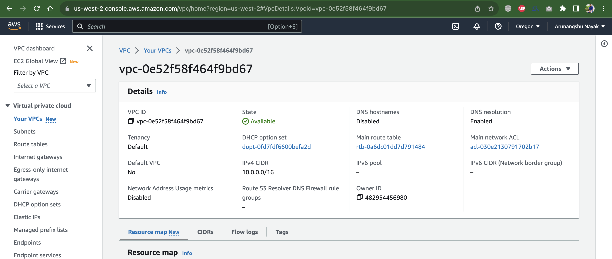
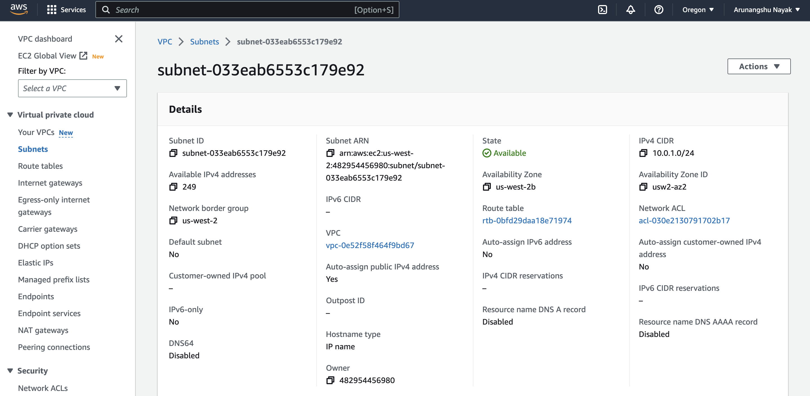
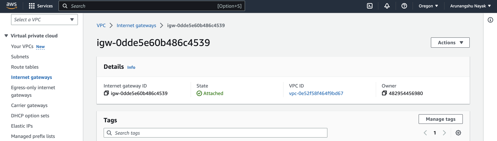
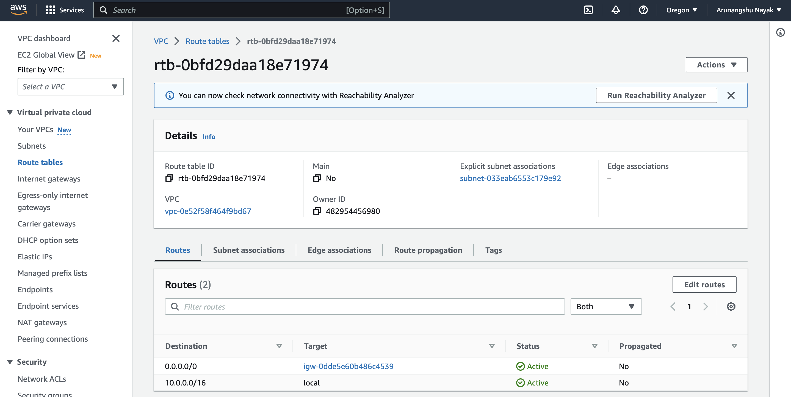
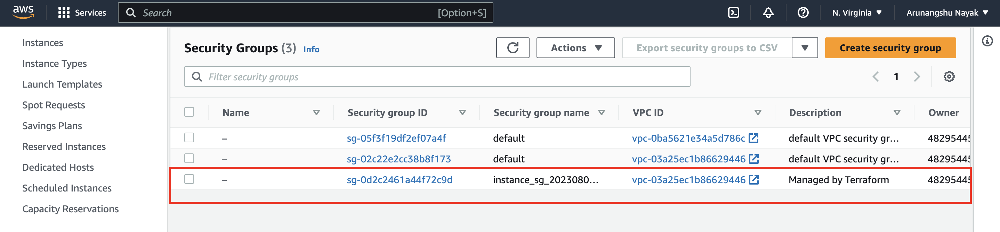
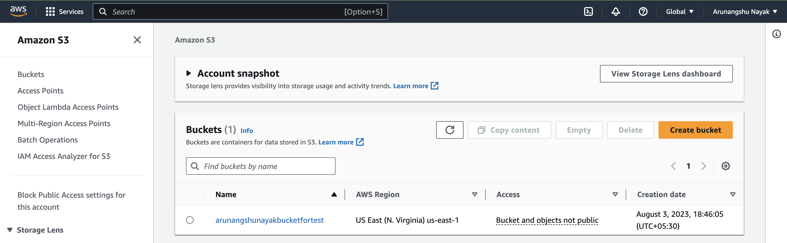

As per the best practice, We can have create the private subnet rather than public.

However, as per the screenshot there was only one subnet. I have created the public subnet so that I can connect with the server.

Once the terraform script is executed, the required infra is created and screenshots are below -

---

---

---

---

---

---

