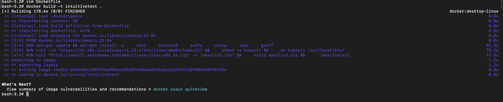
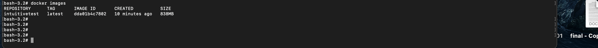
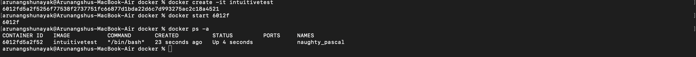
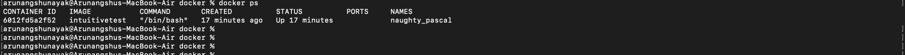

#Intuitive Docker Task

1. Build the docker image locally

2. List the docker images and capture and provide a screenshot

3. Using the image, create and start a container

4. List running containers and capture and provide a screenshot 

5. Update README with commands to create image and create/start container, as well as command that would be used to upload image to DockerHub registry.

In order to upload the image to DockerHub Registry, we need to login into docker hub account

- > docker login

Once logged in, we can push the tagged image to Docker Hub

-> docker push docker_username/intuitivetest
